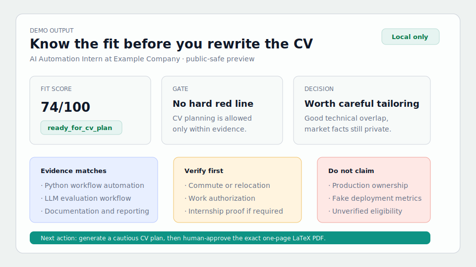

# Apply Less, Fit More

**Know whether a role deserves your CV before you spend hours tailoring it.**

Most job-search tools start by generating more text. This one starts with judgment: fit, blockers, unsupported claims, and a safe boundary for CV edits.

It helps answer:

- Should I apply to this role at all?
- What can I honestly claim from my profile and current CV?
- What needs verification before it becomes public wording?
- What should stay private or off the CV?

It does not auto-apply. It does not invent experience. It keeps the workflow local-first and evidence-first.

## Why It Is Different

- **Gate before generation**: red-line blockers can stop CV planning before wording starts.
- **Evidence over vibes**: every CV idea should trace back to profile, project, current CV, JD, or report evidence.
- **Private by default**: real CVs, memory, job history, and outputs stay in ignored local paths.
- **One-page CV discipline**: LaTeX CV work is bounded by a final exactly-one-page contract.

Use it when you are tired of rewriting resumes for roles that may be blocked by location, proof, authorization, missing evidence, or a mismatch between the JD and your real experience.

## What It Looks Like

This public-safe demo shows the ideal output shape after a job has been analyzed:



See the companion walkthrough: [docs/demo_fit_analysis.md](docs/demo_fit_analysis.md).

## Download

For normal use, download the curated release zip from [GitHub Releases](https://github.com/RachelNongyingLi/job-search-agent/releases):

```text
apply-less-fit-more-v0.1.0.zip
```

GitHub also shows auto-generated `Source code` archives. Prefer the curated zip above because it is built by the release script and checked for private files before publishing.

Optional integrity check:

```bash
shasum -a 256 apply-less-fit-more-v0.1.0.zip
```

Compare it with the `.sha256` file attached to the release.

## Start Here

Unzip the release and enter the folder:

```bash
unzip apply-less-fit-more-v0.1.0.zip
cd apply-less-fit-more-v0.1.0
```

Then install the local app:

```bash
python3 -m venv .venv
source .venv/bin/activate
pip install -e .
```

Use the virtual environment. The app depends on FastAPI, LangGraph, Pydantic, and Uvicorn; installing those into a shared Python environment can conflict with unrelated LangChain packages.

Start the local backend:

```bash
job-agent-web --host 127.0.0.1 --port 8765 --workspace .
```

Open the interface:

```text
http://127.0.0.1:8765/web/index.html
```

If that page says it is serving static files instead of the backend, another server is already using the port. Start the backend on a different port, for example `8766`, and open the matching URL.

```bash
job-agent-web --host 127.0.0.1 --port 8766 --workspace .
```

```text
http://127.0.0.1:8766/web/index.html
```

## Use The Interface

The app has three pages:

- **Application round**: add job evidence, run fit analysis, and inspect results.
- **First use**: create the local workspace, upload the initial CV, and copy the Codex prompt if needed.
- **Settings**: set paths, backend URL, and optional local LLM flags.

Recommended first-time flow:

1. Open **First use**.
2. Create the workspace.
3. Upload your initial CV baseline.
4. Open **Application round**.
5. Add a job URL, PDF reference, TXT/MD file, or pasted JD text.
6. Make sure the final JD text is reviewed locally.
7. Click **Run fit analysis**.
8. Read the gate, red lines, report, next actions, and CV plan if one is allowed.

Website URLs and PDFs are source references. The current backend does not automatically scrape websites or parse PDFs into final JD text yet. Before running analysis, paste or load reviewed JD text.

## What It Creates

The interface uses a fixed local workspace model:

```text
inputs/jobs/<application>.txt       # reviewed JD text
private_resumes/base_cv.pdf         # private initial CV baseline
profiles/me.local.json              # private profile
memory.local.json                   # private cross-application memory
outputs/private/<application>/      # decision, report, next actions, CV plan
```

Expected outputs:

```text
decision.json       # score, status, red lines, do-not-claim items
report.md           # human-readable fit report
next_actions.md     # what to do next
cv_plan.md          # only when the gate allows CV planning
llm_verification.json   # only when optional model drafting is enabled
```

If `cv_plan.md` is missing, treat that as a possible gate result, not automatically as a bug.

## CV Rules

The initial CV is private evidence. It helps the agent understand your current resume; it is not permission to publish or rewrite claims.

Human confirmation is required before:

- editing CV bullets or LaTeX
- turning private facts into public wording
- sending a CV, cover letter, or recruiter message
- accepting the final PDF as a clean, exactly one-page LaTeX CV

Red-line blocks mean no CV bullets, cover letter, recruiter message, or model draft yet.

## Privacy

Keep real job-search material out of git:

- real CVs, PDFs, DOCX files, transcripts, certificates
- `memory.local.json`
- `profiles/*.local.json`
- `outputs/private/`
- application history, recruiter messages, visa/work authorization, address, commute, relocation, or proof documents

The local backend binds to `127.0.0.1`. It does not upload data, store API keys, or auto-apply.

## Using Codex Or Claude

The interface is the main path. Codex or Claude can still help as a local operator when you want reasoning around the files.

Good prompt:

```text
Read AGENTS.md and README.md.
Use the local job-search workflow for this application.
Do not tailor my CV until the gate allows it.
Do not bypass red lines, private evidence rules, or the one-page CV contract.
```

Codex reads `AGENTS.md`. Claude Code reads `CLAUDE.md`, which points back to the same rules.

## Modern Local Stack

The app now uses a modern local AI stack:

- **FastAPI** serves the localhost API and the web interface.
- **LangGraph** is the default workflow engine.
- **Pydantic** validates API payloads and core job/profile/match schemas.

In backend mode, LangGraph can pause at a real human checkpoint before writing `cv_plan.md`. Approve or reject in the interface; the server resumes the same local workflow thread.

Classic linear workflow remains available only as a debugging fallback. To run the default graph workflow from the terminal:

```bash
job-agent workflow run \
  --job inputs/jobs/company_role_YYYY-MM-DD.txt \
  --profile profiles/me.local.json \
  --out-dir outputs/private/company_role_YYYY-MM-DD \
  --memory memory.local.json \
  --engine langgraph
```

This does not loosen scoring, red lines, privacy rules, or artifact names. LangGraph coordinates the steps; the deterministic gate remains authoritative.

## Terminal Fallback

The interface includes a folded **Terminal fallback** command. Use it only when the backend is unavailable or you want to debug the CLI directly.

Example:

```bash
job-agent workflow run \
  --job inputs/jobs/company_role_YYYY-MM-DD.txt \
  --profile profiles/me.local.json \
  --out-dir outputs/private/company_role_YYYY-MM-DD \
  --memory memory.local.json
```

## Build A Release Zip

Before publishing a release, build a curated zip instead of uploading the whole working folder:

```bash
python3 scripts/build_release.py
```

The script only packages public-safe paths and fails if private paths or secret-like values are detected. It writes the zip and a `.sha256` file under `dist/releases/`.

Run tests:

```bash
PYTHONPATH=src python3 -m unittest discover -s tests
```

If `job-agent-web` is not found, rerun `pip install -e .` or use:

```bash
PYTHONPATH=src python3 -m job_agent.server --host 127.0.0.1 --port 8765 --workspace .
```

More detailed Codex/Claude, local LLM, API, and one-page LaTeX CV notes are in [docs/agent_workflow.md](docs/agent_workflow.md).
