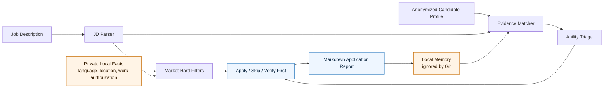
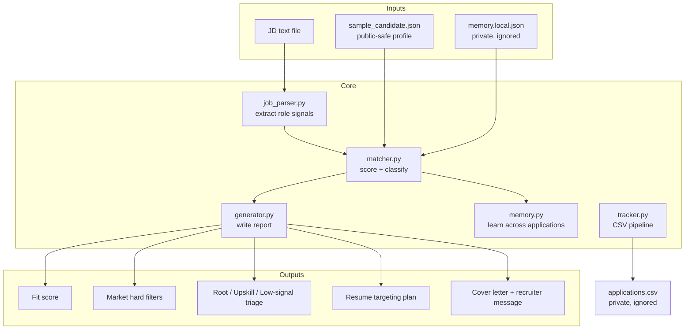
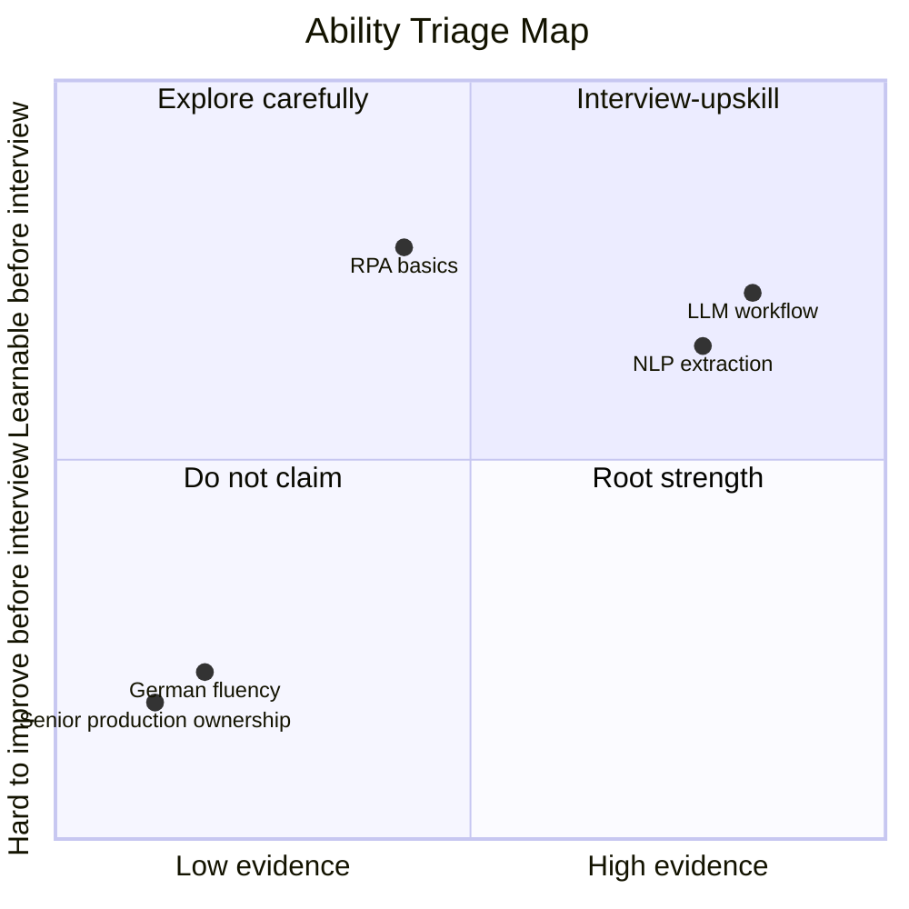

# Precision Job Search Agent

> **Stop applying harder. Start applying smarter.**

The job market has entered a strange new era:

- Companies use AI to screen you.
- Candidates use AI to apply faster.
- Everyone is generating more text.
- Nobody is getting more signal.

This project is a local-first job search agent for the part most AI tools still miss:

**Should you even apply, and what can you honestly change before you do?**

It is not an auto-apply bot. It is a precision-application system that separates real fit from resume cosplay.

## System Flow



## The Problem

Most AI job tools optimize for volume:

```text
resume + job description -> match score -> prettier resume -> more applications
```

That sounds useful until reality arrives.

A candidate can be technically strong and still lose because of:

- language requirements
- work authorization
- onsite / hybrid expectations
- commute distance
- relocation constraints
- student status
- start date
- local hiring preference
- company-specific domain expectations

Meanwhile, generic AI resume tools often do the one thing you cannot afford:

**They turn weak evidence into confident claims.**

They make you sound like you owned production systems you never touched, led teams you never led, or mastered tools you only saw in a tutorial. That may help with a keyword screen. It hurts the moment a human interviewer asks follow-up questions.

## The Thesis

The next useful job-search agent is not the one that applies to 500 jobs.

It is the one that can say:

```text
Do not spend three hours tailoring this.
The hard filter is language, not Python.
```

or:

```text
This is worth tailoring.
Your root evidence matches the role.
The only gap is learnable before interview.
```

or:

```text
Do not claim this.
Put it into the upskill plan instead.
```

## What Makes This Different

### 1. Market Hard Filters

Before talking about skills, the agent checks whether the job may be blocked by market constraints.

Examples:

- German required, but the profile does not claim German.
- Work authorization mentioned, but public profile keeps it private.
- Onsite / commute / relocation language appears in the JD.
- Local candidate preference may matter more than technical overlap.

This is where mass applying fails. It treats every job description like text. The real market treats some lines like gates.

### 2. Ability Triage

Every requirement is classified into one of three buckets.

| Bucket | Meaning | Resume Behavior |
|---|---|---|
| Root Strength | You can prove it with projects, research, coursework, or work. | Emphasize it. |
| Interview-Upskill | You can realistically learn or refresh it before interview. | Prepare it, do not overclaim it. |
| Low-Signal / Unsupported | It is irrelevant, too senior, noisy, or not backed by evidence. | Do not stuff it into the resume. |

This is the anti-hallucination layer.

The goal is not to make the candidate sound bigger. The goal is to make the candidate harder to misunderstand.

### 3. Local Application Memory

One application should make the next one smarter.

The agent can update an ignored local memory file with:

- repeated market blockers
- repeated learnable gaps
- role clusters where root strengths show up
- signals that should affect future targeting

The memory is local. The public repo stays clean.

```bash
job-agent analyze \
  --job examples/ai_automation_jd.txt \
  --out outputs/example_report.md \
  --memory memory.local.json
```

## Agent Architecture



## Why Now

Agent projects in 2025-2026 are converging on a few themes:

- **Local-first execution**: private data should stay on the user machine.
- **Durable memory**: agents need continuity across sessions, not one-off prompts.
- **Auditable artifacts**: the agent should leave behind reports, decisions, and traces.
- **Workflow-specific agents**: generic chat is giving way to narrow agents with real constraints.

Job search needs exactly that.

Not another cover-letter generator.

A local workflow that remembers what the market keeps telling you.

## What It Does Today

- Reads a local `.txt` or `.md` job description.
- Matches it against an anonymized structured candidate profile.
- Produces a Markdown report with:
  - fit score
  - apply decision
  - evidence-backed strengths
  - market hard-filter warnings
  - root strength / interview-upskill / low-signal triage
  - resume targeting plan
  - memory updates
  - cover letter draft
  - recruiter message draft
- Tracks applications in a local CSV file.
- Optionally updates private local memory.
- Runs without external APIs.

## Example Output



```text
Fit score: 95/100
Decision: Strong apply: tailor the resume and apply.

Market Hard Filters
- No hard market filter was detected by the local rules.
- Still verify location, language, and work authorization manually.

Ability Triage
Root Strengths
- python
- llm
- agent
- workflow
- nlp

Interview-Upskill Items
- rpa

Resume Targeting Plan
- Lead with the agentic AI workflow project.
- Quantify evaluation work where possible.
- Create a short interview-prep plan for learnable gaps.
- Do not publish generated resumes or application records.
```

## Quick Start

```bash
cd job-search-agent
python3 -m venv .venv
source .venv/bin/activate
pip install -e .
```

Analyze a job:

```bash
job-agent analyze \
  --job examples/ai_automation_jd.txt \
  --out outputs/example_report.md
```

Analyze and update local memory:

```bash
job-agent analyze \
  --job examples/ai_automation_jd.txt \
  --out outputs/example_report.md \
  --memory memory.local.json
```

Track an application:

```bash
job-agent track add \
  --company "Example Semiconductor" \
  --role "AI Automation Intern" \
  --status "tailoring" \
  --notes "Check language and onsite requirements before deep tailoring"

job-agent track list
```

## Privacy By Design

This repo is safe for public GitHub because the default profile is anonymized:

```text
profiles/sample_candidate.json
```

Do not commit private candidate data:

- real name
- phone number
- email
- date of birth
- student ID
- transcripts
- certificates
- visa or work-authorization details
- commute or address details
- real application records
- generated resumes

Ignored by default:

```text
data/private/
outputs/private/
outputs/
applications.csv
memory.local.json
*.local.json
*.docx
*.pdf
*.xlsx
*.xls
```

## Project Structure

```text
job-search-agent/
├── docs/
│   └── analysis_zh.md
├── examples/
│   └── ai_automation_jd.txt
├── profiles/
│   └── sample_candidate.json
├── src/job_agent/
│   ├── cli.py
│   ├── generator.py
│   ├── job_parser.py
│   ├── matcher.py
│   ├── memory.py
│   ├── models.py
│   ├── profile.py
│   └── tracker.py
├── tests/
│   └── test_matcher.py
├── .gitignore
├── pyproject.toml
└── README.md
```

## Roadmap

- Private memory dashboard.
- Better extraction of language, visa, location, commute, and start-date filters.
- Resume planner that refuses unsupported claims.
- Interview prep mode based on upskill items.
- Role-cluster analytics across applications.
- Optional LLM provider with strict factuality guards.
- Local web UI for reviewing the application pipeline.

## Influences

This README intentionally follows the 2025-2026 agent-project pattern: sharp thesis, local-first privacy, durable memory, visible workflow artifacts, and a clear anti-hype boundary.

Related signals:

- Agent memory is becoming a first-class research topic, with benchmarks focused on long-horizon and multi-session memory.
- Recent local-first memory projects emphasize private execution, auditability, and persistent context.
- Existing job-search tools often focus on ATS scores, resume tailoring, and auto-apply. This project focuses on precision, market filters, and truthful application strategy.

Useful references:

- [MemoryArena](https://digitaleconomy.stanford.edu/publication/memoryarena-benchmarking-agent-memory-in-interdependent-multi-session-agentic-tasks/) frames agent memory as multi-session learning, not just long context.
- [MemoryAgentBench](https://huggingface.co/papers/2507.05257) highlights retrieval, test-time learning, long-range understanding, and conflict resolution as memory-agent capabilities.
- [Memoria](https://github.com/matrixorigin/Memoria) positions agent memory around privacy, audit trails, snapshots, and rollback.
- [Sediment](https://github.com/rendro/sediment) is an example of the local-first memory README style: clear benchmark table, data location, and privacy promise.
- [resuml](https://github.com/phoinixi/resuml) shows the current resume-as-code direction: structured resume data, ATS checks, and AI-agent integration.
- [ApplyPilot](https://github.com/Pickle-Pixel/ApplyPilot) represents the opposite pole: autonomous job applications. This project deliberately chooses precision and review over auto-submit.

## Status

MVP.

Useful enough to show the idea.

Small enough to stay honest.

## Disclaimer

This is not a replacement for judgment. It is a tool for making judgment harder to skip.

Do not use it to fabricate experience, hide hard constraints, or submit applications without review.
