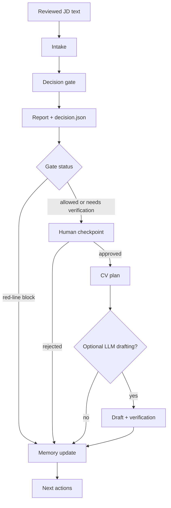

# Apply Less, Fit More

**A local-first LangGraph agent that helps you decide whether to apply, verify, or skip before you spend hours tailoring your CV.**

Most job-search tools start with generation: they rewrite bullets, add keywords, and make the CV sound stronger.

This project starts one step earlier:

> Before improving the CV, it checks whether the role is worth pursuing and what you can honestly claim.

It analyzes a reviewed job description against your real profile, current CV evidence, and local memory. Then it creates private artifacts such as:

- `decision.json` — fit score, status, red lines, and do-not-claim items
- `report.md` — a human-readable fit report
- `next_actions.md` — what to verify, improve, or avoid next
- `cv_plan.md` — only when the gate allows CV planning
- `llm_verification.json` — only when optional model drafting is enabled

It does **not** auto-apply. It does **not** invent experience. It keeps the workflow **local-first**, **evidence-first**, and **human-confirmed** before public-facing CV changes.

---

## The Core Idea

**Gate before generation.**

A normal AI resume tool often does this:

```text
Job description + CV
        ↓
Generate stronger resume wording
        ↓
User has to decide whether the claims are safe
```

This agent does this instead:

```text
Job description + profile + current CV evidence
        ↓
Check fit, blockers, missing proof, and unsafe claims
        ↓
Decide whether CV planning is allowed
        ↓
Generate a CV plan only after the gate passes
```

That design matters because not every role deserves a tailored CV. Some roles are blocked by location, language proof, authorization, missing evidence, seniority mismatch, or hard requirements that should not be softened into vague resume language.

---

## 30-Second Example

Input:

```text
JD requirement:
- SQL and Python
- dashboard reporting
- German C1
- work authorization for Germany

Candidate evidence:
- SQL and Python academic projects
- dashboard project experience
- English working proficiency
- no German C1 evidence yet
- authorization status is private / unverified
```

Output:

```text
Decision: verify first

Red lines:
- German C1 appears to be a hard requirement, but no evidence was found.
- Work authorization should not be implied until confirmed.

Do not claim:
- German business fluency
- unrestricted work authorization
- production ownership of dashboards
- senior stakeholder leadership without supporting evidence

Allowed direction:
- emphasize SQL and Python evidence
- describe dashboard work only at the level supported by the project history
- verify language and authorization before public CV wording
```

If the gate blocks the role, the agent should still write a report and next actions. It should **not** write CV bullets, cover letters, recruiter messages, or model-generated public wording.

---

## What This Is Not

This is not:

- an auto-apply bot
- a resume keyword-stuffing tool
- a tool for inventing or upgrading experience
- a recruiter spam generator
- a cloud resume storage product
- a replacement for human judgment on legal, immigration, or employment-risk questions

The goal is not to apply to more jobs. The goal is to spend effort only where the fit is real and the claims are safe.

---

## What It Looks Like

This public-safe demo shows the expected output shape after a job has been analyzed:


See the companion walkthrough: [docs/demo_fit_analysis.md](docs/demo_fit_analysis.md).

---

## How The Workflow Works



The deterministic gate remains the authority for fit, red lines, and claim safety. LangGraph coordinates state, branching, and human checkpoints; it does not replace the project’s scoring and safety rules.

Current graph shape:

```text
intake
  -> gate
  -> report
  -> cv_plan_checkpoint      # human checkpoint before CV planning
  -> cv_plan                 # skipped on red_line_block or rejected checkpoint
  -> llm_draft               # only if cv_plan exists and LLM is enabled
  -> public_output_checkpoint # reserved for a future public-output builder
  -> final_pdf_checkpoint     # reserved for a future final-PDF builder
  -> memory
  -> next_actions
```

---

## When To Use It

Use this when you are evaluating a role and want to know:

- whether the role is worth applying to at all
- which hard requirements are blocked, missing, or private
- what you can honestly claim from your current evidence
- what needs verification before it becomes public wording
- what should stay off the CV
- whether a CV plan is safe to generate

It is especially useful for roles where the JD has hard filters, ambiguous seniority, language requirements, relocation/commute constraints, authorization issues, or skills that are easy for a model to overstate.

---

## Project Status

Current release line: **v0.1.0 local prototype**.

Works today:

- local web console
- reviewed JD text input
- private profile and memory files
- fit analysis
- red-line checks
- do-not-claim items
- `decision.json`, `report.md`, and `next_actions.md`
- gated `cv_plan.md`
- LangGraph backend workflow with a human checkpoint before CV planning
- CLI fallback for debugging

Current boundaries:

- Website URLs and PDFs are treated as source references.
- The backend does not automatically scrape websites into final JD text yet.
- The backend does not automatically parse PDFs into final JD text yet.
- The workflow still runs from reviewed local `.txt` or `.md` JD text.
- Public-output and final-PDF approval nodes are present in the graph, but they are reserved until public-output and PDF builders are added.
- The local FastAPI server currently keeps checkpoint state in process. Restart the run if the server process restarts.

---

## Download

For normal use, download the curated release zip from [GitHub Releases](https://github.com/RachelNongyingLi/job-search-agent/releases):

```text
apply-less-fit-more-v0.1.0.zip
```

GitHub also shows auto-generated `Source code` archives. Prefer the curated zip above because it is built by the release script and checked for private files before publishing.

Optional integrity check:

```bash
shasum -a 256 apply-less-fit-more-v0.1.0.zip
```

Compare the result with the `.sha256` file attached to the release.

---

## Quickstart

Requirements:

- Python 3.10+
- A virtual environment is strongly recommended

Unzip the release and enter the folder:

```bash
unzip apply-less-fit-more-v0.1.0.zip
cd apply-less-fit-more-v0.1.0
```

Install the local app:

```bash
python3 -m venv .venv
source .venv/bin/activate
pip install -e .
```

Start the local backend:

```bash
job-agent-web --host 127.0.0.1 --port 8765 --workspace .
```

Open the interface:

```text
http://127.0.0.1:8765/web/index.html
```

If the page appears to be served by a generic static server instead of the backend, another process may already be using the port. Start the backend on another port and open the matching URL:

```bash
job-agent-web --host 127.0.0.1 --port 8766 --workspace .
```

```text
http://127.0.0.1:8766/web/index.html
```

---

## First-Time Use

The web interface has three main pages:

- **Application round** — add job evidence, run fit analysis, inspect artifacts
- **First use** — create the local workspace, upload the initial CV, copy the operator prompt if needed
- **Settings** — set paths, backend URL, and optional local LLM flags

Recommended flow:

1. Open **First use**.
2. Create the local workspace.
3. Upload your initial CV baseline.
4. Open **Application round**.
5. Add a job URL, PDF reference, TXT/MD file, or pasted JD text.
6. Make sure the final JD text is reviewed locally.
7. Click **Run fit analysis**.
8. Read the gate result, red lines, report, next actions, and CV plan if one is allowed.

Important: website URLs and PDFs are source references. Before running analysis, paste or load reviewed JD text into the local workflow.

---

## Local Workspace

The app expects a fixed local workspace model:

```text
inputs/jobs/<application>.txt       # reviewed JD text
private_resumes/base_cv.pdf         # private initial CV baseline
profiles/me.local.json              # private structured profile
memory.local.json                   # private cross-application memory
outputs/private/<application>/      # decision, report, next actions, CV plan
```

Expected output artifacts:

```text
decision.json           # score, status, red lines, do-not-claim items
report.md               # human-readable fit report
next_actions.md         # what to verify, improve, avoid, or do next
cv_plan.md              # only when the gate allows CV planning
cv_plan.llm.md          # only when optional LLM drafting is enabled and accepted
llm_verification.json   # only when optional model drafting is enabled
```

If `cv_plan.md` is missing, do not assume the run failed. It may be an intentional gate result.

---

## Privacy And Safety Model

Keep real job-search material out of git:

- real CVs, PDFs, DOCX files, transcripts, certificates
- `memory.local.json`
- `profiles/*.local.json`
- `outputs/private/`
- application history
- recruiter messages
- visa, authorization, address, commute, relocation, and proof documents

The local backend binds to `127.0.0.1`. The default workflow uses local files and private output folders.

Optional LLM drafting is deliberately late in the pipeline. It should only run after deterministic CV planning exists, and its output must pass verification before it is treated as usable. Treat any configured model endpoint according to its own privacy behavior.

---

## CV Rules

The initial CV is private evidence. It helps the agent understand the current resume, but it is not permission to publish or rewrite claims.

Human confirmation is required before:

- editing CV bullets or LaTeX
- turning private facts into public wording
- sending a CV, cover letter, or recruiter message
- accepting a final one-page PDF as ready

Red-line blocks mean:

```text
no CV bullets
no cover letter
no recruiter message
no model draft
```

The agent may be more conservative than the user. It must not be less conservative than the gate.

---

## Evidence Rules

Every CV idea should trace back to one of these sources:

- profile evidence
- project evidence
- current CV evidence
- reviewed JD text
- generated report evidence
- local memory evidence

Bad behavior:

```text
JD asks for Kubernetes.
The candidate has a generic cloud project.
The agent writes: "Kubernetes experience".
```

Correct behavior:

```text
No direct Kubernetes evidence found.
Mark as verify-first or do-not-claim.
Suggest learning or verification instead of claiming experience.
```

The agent must not turn:

- learnable skills into proven experience
- project exposure into production ownership
- private facts into public wording without approval
- missing metrics into invented metrics
- language familiarity into professional proficiency
- unverified authorization into eligibility claims

---

## Architecture

```text
FastAPI     -> localhost backend and web interface
LangGraph   -> workflow state, branching, and human checkpoints
Pydantic    -> typed API payloads and job/profile/match schemas
Local files -> private inputs, outputs, and memory
```

The key separation is:

```text
Deterministic gate decides fit, blockers, and claim safety.
LangGraph coordinates the workflow.
Optional LLM drafting helps with wording only after the gate allows planning.
Verification decides whether model-assisted wording is acceptable.
```

This is the main reason the project is an agentic workflow rather than a simple LLM wrapper.

---

## CLI Fallback

The web interface is the main path. Use the CLI when the backend is unavailable or when you want to debug the workflow directly.

Run the default LangGraph workflow:

```bash
job-agent workflow run \
  --job inputs/jobs/company_role_YYYY-MM-DD.txt \
  --profile profiles/me.local.json \
  --out-dir outputs/private/company_role_YYYY-MM-DD \
  --memory memory.local.json \
  --engine langgraph
```

Classic linear mode remains available only as a debugging fallback:

```bash
job-agent workflow run \
  --job inputs/jobs/company_role_YYYY-MM-DD.txt \
  --profile profiles/me.local.json \
  --out-dir outputs/private/company_role_YYYY-MM-DD \
  --memory memory.local.json \
  --engine classic
```

Neither mode loosens scoring, red lines, privacy rules, or artifact names.

---

## Using Codex Or Claude As A Local Operator

The interface is the main path. Codex or Claude can still help reason around the local files when used as an operator.

Recommended prompt:

```text
Read AGENTS.md and README.md.
Use the local job-search workflow for this application.
Do not tailor my CV until the gate allows it.
Do not bypass red lines, private evidence rules, or the one-page CV contract.
Run or mirror the local analyzer first, then read decision.json, report.md, and next_actions.md.
Only produce CV or cover-letter planning if the workflow status allows it.
```

Codex reads `AGENTS.md`. Claude Code reads `CLAUDE.md`, which points back to the same project rules.

---

## More Documentation

More detailed notes are available in:

- [docs/agent_workflow.md](docs/agent_workflow.md) — workflow, LangGraph, local LLM, checkpoint, and operator notes
- [docs/demo_fit_analysis.md](docs/demo_fit_analysis.md) — public-safe output walkthrough
- [AGENTS.md](AGENTS.md) — rules for agent behavior and claim safety
- [CLAUDE.md](CLAUDE.md) — Claude Code entrypoint that points back to the same rules

---

## Suggested GitHub Repository Metadata

Repository description:

```text
Local-first LangGraph agent for job-fit gating, red-line checks, and safe CV planning.
```

Suggested topics:

```text
langgraph
ai-agent
job-search
resume
cv
fastapi
pydantic
local-first
human-in-the-loop
privacy
```
