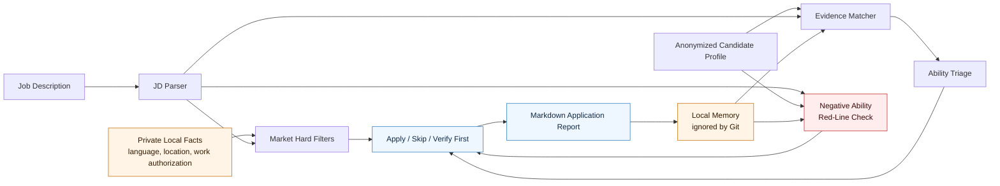
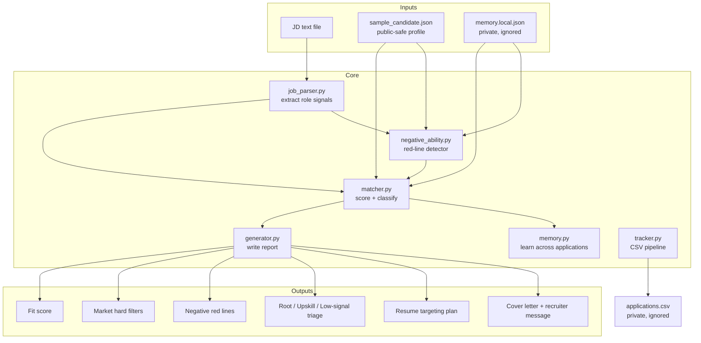
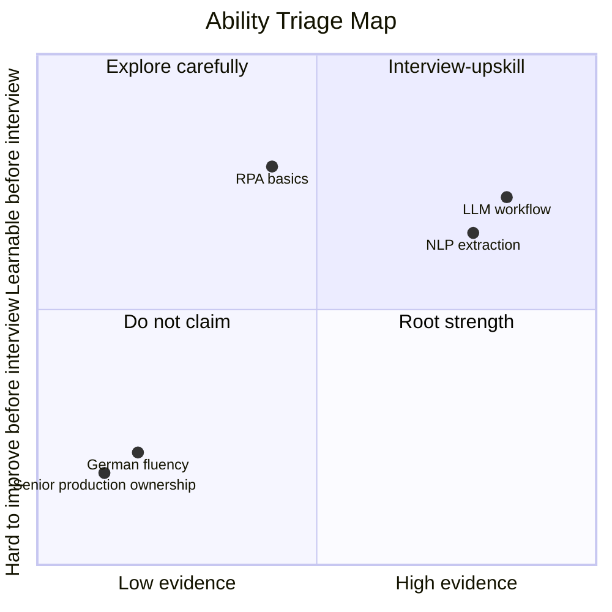

# Apply Less, Fit More 🚀

> **A local-first job search agent that kills resume spam and turns applications into evidence.**

Everyone is using AI now.

- Companies use AI to screen candidates.
- Candidates use AI to blast out resumes.
- Recruiters drown in generated text.
- Applicants drown in silence.

So here is the uncomfortable truth:

**AI did not fix job search. It made low-quality applying cheaper.**

This project is built for the missing layer:

```text
Before writing a better resume,
ask whether this job is worth a better resume.
```

It is not an auto-apply bot.

It is a precision-application agent that tells you:

- what is a real fit
- what is a hard market blocker
- what can be learned before interview
- what should never be claimed
- what the next application should remember

No resume cosplay. No fake seniority. No “spray and pray” dashboard with nicer fonts.

Just better judgment, saved locally. 🧠

## The One-Picture Pitch



## The Resume Spam Era

Most AI job tools are built around the same funnel:

```text
resume + job description -> match score -> prettier resume -> more applications
```

Sounds great.

Until you realize the market does not only ask:

```text
Can this person do the work?
```

It also asks:

```text
Can we hire this person, here, now, under these constraints?
```

A candidate can be technically strong and still lose because of:

- language requirements
- work authorization
- onsite / hybrid expectations
- commute distance
- relocation constraints
- student status
- start date
- local hiring preference
- company-specific domain expectations

And then generic AI resume tools make it worse.

They do the one thing a serious candidate cannot afford:

> **They turn weak evidence into confident claims.**

They make you sound like you owned production systems you never touched, led teams you never led, or mastered tools you only saw in a tutorial. That may help with a keyword screen. It hurts the moment a human interviewer asks follow-up questions.

## The Bet

The next great job-search agent will not be the one that applies to 500 jobs while you sleep.

It will be the one brave enough to say:

```text
Do not spend three hours tailoring this.
The hard filter is language, not Python.
```

or:

```text
This is worth tailoring.
Your root evidence matches the role.
The only gap is learnable before interview.
```

or:

```text
Do not claim this.
Put it into the upskill plan instead.
```

That is the product.

Not more applications.

More correct applications.

## The Four Filters 🔥

### 1. Market Hard Filters: the stuff ATS tutorials ignore

Before talking about skills, the agent checks whether the job may be blocked by real-world constraints.

Examples:

- German required, but the profile does not claim German.
- Work authorization mentioned, but public profile keeps it private.
- Onsite / commute / relocation language appears in the JD.
- Local candidate preference may matter more than technical overlap.

This is where mass applying fails. It treats every job description like text. The real market treats some lines like gates.

### 2. Ability Triage: stop pretending every gap is the same

Every requirement is classified into one of three buckets.

| Bucket | Meaning | Resume Behavior |
|---|---|---|
| Root Strength | You can prove it with projects, research, coursework, or work. | Emphasize it. |
| Interview-Upskill | You can realistically learn or refresh it before interview. | Prepare it, do not overclaim it. |
| Low-Signal / Unsupported | It is irrelevant, too senior, noisy, or not backed by evidence. | Do not stuff it into the resume. |

This is the anti-hallucination layer.

The goal is not to make the candidate sound bigger. The goal is to make the candidate harder to misunderstand.

### 3. Negative Ability / Red-Line Check: stop memory from becoming a hype engine

More memory is useful only if the system also remembers what must not be softened.

This layer looks for negative evidence and absolute red lines before the report can recommend tailoring.

Examples:

- The JD requires proof of a mandatory or compulsory internship, but no private local proof is confirmed.
- The JD uses hard onsite/local/commute language, and the local commute or relocation facts are blocked or unknown.
- The JD requires an unrelated domain, and the only way to sound matched would be to rewrite an existing project into something it never did.

When a red line is triggered:

- the score is capped
- the decision becomes verify-first or skip-first
- generated cover-letter and recruiter-message drafts are withheld for block-level signals
- memory stores the negative signal separately so future applications cannot convert it into a strength

This is the counterweight to long-context sycophancy and score inflation.

### 4. Local Application Memory: every rejection should teach the next application

One application should make the next one smarter.

The agent can update an ignored local memory file with:

- repeated market blockers
- repeated learnable gaps
- role clusters where root strengths show up
- signals that should affect future targeting

The memory is local. The public repo stays clean.

```bash
job-agent analyze \
  --job examples/ai_automation_jd.txt \
  --out outputs/example_report.md \
  --memory memory.local.json
```

## Under The Hood



## Why This Should Exist Now

Agent projects in 2025-2026 are converging on the same few truths:

- **Local-first execution**: private data should stay on the user machine.
- **Durable memory**: agents need continuity across sessions, not one-off prompts.
- **Auditable artifacts**: the agent should leave behind reports, decisions, and traces.
- **Workflow-specific agents**: generic chat is giving way to narrow agents with real constraints.

Job search needs all four.

Not another cover-letter generator.

A local workflow that remembers what the market keeps telling you.

The brutal version:

```text
If the agent cannot remember why the last 30 applications failed,
it is not a job-search agent.
It is a text box with ambition.
```

## What It Does Today ✨

- Reads a local `.txt` or `.md` job description.
- Matches it against an anonymized structured candidate profile.
- Produces a Markdown report with:
  - fit score
  - apply decision
  - evidence-backed strengths
  - market hard-filter warnings
  - negative ability / red-line signals
  - root strength / interview-upskill / low-signal triage
  - resume targeting plan
  - memory updates
  - cover letter draft
  - recruiter message draft
- Tracks applications in a local CSV file.
- Optionally updates private local memory.
- Runs without external APIs.

## Demo: From Vibes To Evidence



```text
Fit score: 95/100
Decision: Strong apply: tailor the resume and apply.

Market Hard Filters
- No hard market filter was detected by the local rules.
- Still verify location, language, and work authorization manually.

Negative Ability / Red-Line Check
- No negative ability red line was detected by the local rules.

Ability Triage
Root Strengths
- python
- llm
- agent
- workflow
- nlp

Interview-Upskill Items
- rpa

Resume Targeting Plan
- Lead with the agentic AI workflow project.
- Quantify evaluation work where possible.
- Create a short interview-prep plan for learnable gaps.
- Do not publish generated resumes or application records.
```

## Quick Start

```bash
cd job-search-agent
python3 -m venv .venv
source .venv/bin/activate
pip install -e .
```

Analyze a job:

```bash
job-agent analyze \
  --job examples/ai_automation_jd.txt \
  --out outputs/example_report.md
```

Analyze and update local memory:

```bash
job-agent analyze \
  --job examples/ai_automation_jd.txt \
  --out outputs/example_report.md \
  --memory memory.local.json
```

Run tests:

```bash
PYTHONPATH=src python3 -m unittest discover -s tests
```

Track an application:

```bash
job-agent track add \
  --company "Example Semiconductor" \
  --role "AI Automation Intern" \
  --status "tailoring" \
  --notes "Check language and onsite requirements before deep tailoring"

job-agent track list
```

## Use With Codex Or Claude Code

This repo is designed to work well with coding agents because the durable rules live in files, not in vibes.

```text
AGENTS.md      # Codex project instructions
CLAUDE.md      # Claude Code entrypoint; imports AGENTS.md
README.md      # human workflow and copy-paste prompts
*.local.json   # private facts, ignored by Git
memory.local.json
outputs/private/
```

Codex reads `AGENTS.md` project guidance. Claude Code reads `CLAUDE.md`; this repo's `CLAUDE.md` imports `AGENTS.md` so both agents follow the same privacy, memory, red-line, and CV rules.

### One-Time Local Setup

Keep public demo data and real private data separate.

```bash
mkdir -p inputs/jobs data/private outputs/private private_resumes
cp profiles/sample_candidate.json profiles/me.local.json
```

Then edit `profiles/me.local.json` locally with your real, private profile. Keep sensitive facts compact and decision-oriented:

```json
{
  "market_facts": {
    "languages_claimed": ["English"],
    "languages_not_claimed": ["German"],
    "mandatory_internship_proof": "verified_private",
    "commute_or_relocation": "ask locally before recommending onsite roles"
  }
}
```

Do not paste certificates, transcripts, full addresses, visa documents, or recruiter conversations into tracked files. Store real CVs under `private_resumes/`, real JD files under `inputs/jobs/`, and real outputs under `outputs/private/`.

### Recommended Agent Prompt

Use this prompt in Codex or Claude Code when you add a new job:

```text
You are my local job-search agent for this repo.

Before judging this role, read:
- README.md
- AGENTS.md or CLAUDE.md
- profiles/me.local.json if present
- memory.local.json if present
- the JD at inputs/jobs/<company_role_date>.txt

Do not tailor my CV yet.
First run or mirror the local analyzer and produce:
1. apply / selective apply / verify-first / skip decision
2. market hard filters
3. negative ability red lines
4. root strengths
5. interview-upskill items
6. do-not-claim items
7. what memory should remember
```

Run the local analyzer:

```bash
job-agent analyze \
  --job inputs/jobs/company_role_YYYY-MM-DD.txt \
  --profile profiles/me.local.json \
  --out outputs/private/company_role_report.md \
  --memory memory.local.json
```

### Multi-Round Applications

When you have applied to several related roles, keep the agent anchored to local evidence instead of the conversation history.

```text
Read memory.local.json and the latest report in outputs/private/.
Tell me whether this new role is genuinely better, worse, or just keyword-similar.

Do not raise the score because I want the role.
If old memory contains a red line, preserve it unless a private local fact explicitly resolves it.
```

After applying, track the outcome:

```bash
job-agent track add \
  --company "Company" \
  --role "Role" \
  --status "applied" \
  --link "https://..." \
  --resume-version "company_role_YYYY-MM-DD" \
  --notes "Verified location; used AI workflow + NLP version"
```

### CV Tailoring Prompt

Use two steps. First ask for a plan:

```text
Read outputs/private/company_role_report.md and my current CV.
Create a CV targeting plan only.

Separate:
- supported claims I can safely emphasize
- claims that need weaker wording
- things that belong in interview prep, not the CV
- things I must not claim

Show a claim-evidence table before drafting bullets.
```

Then ask for edits:

```text
Now revise my CV bullets for this role.

Rules:
- Do not invent company names, production ownership, deployment, leadership, metrics, tools, authorization, or language fluency.
- Every strong claim must cite evidence from my profile, current CV, project, or report.
- If evidence is missing, write it as an upskill/interview-prep item instead.
- Preserve red-line warnings from memory.local.json and the report.
- Label every bullet as safe, needs verification, or too strong / do not use.
```

### Future LaTeX CV Contract

The planned CV workflow is a truth-preserving one-page LaTeX compiler, not a resume optimizer.

```text
templates/cv.tex                  # public-safe one-page LaTeX template
profiles/sample_candidate.json    # anonymized demo profile
profiles/me.local.json            # real private profile, ignored by Git
outputs/private/                  # generated CVs and QA reports, ignored by Git
```

A future command may look like this:

```bash
job-agent cv build \
  --job inputs/jobs/company_role_YYYY-MM-DD.txt \
  --profile profiles/me.local.json \
  --template templates/cv.tex \
  --out outputs/private/company_role_cv.pdf
```

The CV builder should accept an output only after QA passes:

- LaTeX compiles successfully
- the PDF is exactly one page
- no private data leaks into public outputs
- no unsupported claim appears
- no red-line rule is violated
- a `.qa.json` report is written next to the PDF

If the CV does not fit on one page, the agent should remove the weakest and least relevant content first. If it still cannot fit cleanly, it should fail with a clear explanation instead of producing an ugly or misleading resume.

### Safe Use Checklist

- Use `profiles/sample_candidate.json` for public demos only.
- Put your real profile in a `*.local.json` file.
- Treat `memory.local.json` as sensitive; it can reveal your job-search history and eligibility constraints.
- Keep visa, address, phone, email, student ID, transcripts, certificates, commute details, and application history out of Git.
- Store real application outputs under `outputs/private/`.
- Never ask an agent to commit generated CVs, cover letters, application trackers, or private memory.
- Before publishing a CV or report, check that every claim is public-safe and evidence-backed.
- If a job requires work authorization, mandatory internship proof, relocation, onsite work, or local language fluency, verify privately before generating application text.
- Run `git status --short` before every commit and inspect any profile, report, CSV, PDF, DOCX, TeX, or JSON file that appears.

Rule of thumb: if you would not paste it into a public GitHub issue, do not put it in a tracked file.

## Privacy By Design 🔒

This repo is safe for public GitHub because the default profile is anonymized:

```text
profiles/sample_candidate.json
```

Do not commit private candidate data:

- real name
- phone number
- email
- date of birth
- student ID
- transcripts
- certificates
- visa or work-authorization details
- commute or address details
- real application records
- generated resumes

Ignored by default:

```text
data/private/
inputs/jobs/
private_resumes/
outputs/private/
outputs/
applications.csv
memory.local.json
*.local.json
CLAUDE.local.md
*.docx
*.pdf
*.xlsx
*.xls
```

## Project Structure

```text
job-search-agent/
├── docs/
│   └── analysis_zh.md
├── examples/
│   └── ai_automation_jd.txt
├── profiles/
│   └── sample_candidate.json
├── src/job_agent/
│   ├── cli.py
│   ├── generator.py
│   ├── job_parser.py
│   ├── matcher.py
│   ├── memory.py
│   ├── models.py
│   ├── negative_ability.py
│   ├── profile.py
│   └── tracker.py
├── tests/
│   ├── test_generator.py
│   ├── test_matcher.py
│   └── test_memory.py
├── AGENTS.md
├── CLAUDE.md
├── .gitignore
├── pyproject.toml
└── README.md
```

## Roadmap: From MVP To Job-Search OS

- Private memory dashboard.
- Better extraction of language, visa, location, commute, and start-date filters.
- Calibrated sub-scores for technical evidence, market constraints, claim safety, and tailoring ROI.
- Resume planner that refuses unsupported claims.
- One-page LaTeX CV builder with compile, page-count, privacy, and unsupported-claim QA.
- Interview prep mode based on upskill items.
- Role-cluster analytics across applications.
- Optional LLM provider with strict factuality guards.
- Local web UI for reviewing the application pipeline.

## Why This Is Not Just Another Resume Tool

This README intentionally follows the 2025-2026 agent-project pattern: sharp thesis, local-first privacy, durable memory, visible workflow artifacts, and a clear anti-hype boundary.

Related signals:

- Agent memory is becoming a first-class research topic, with benchmarks focused on long-horizon and multi-session memory.
- Recent local-first memory projects emphasize private execution, auditability, and persistent context.
- Existing job-search tools often focus on ATS scores, resume tailoring, and auto-apply. This project focuses on precision, market filters, and truthful application strategy.

Useful references:

- [Codex AGENTS.md guidance](https://developers.openai.com/codex/guides/agents-md) explains how Codex loads repository instructions.
- [Codex memories](https://developers.openai.com/codex/memories) motivates keeping required project rules in checked-in instructions instead of relying only on platform memory.
- [Claude Code memory docs](https://code.claude.com/docs/zh-CN/memory) explain `CLAUDE.md`, local memory files, and importing `AGENTS.md`.
- [MemoryArena](https://digitaleconomy.stanford.edu/publication/memoryarena-benchmarking-agent-memory-in-interdependent-multi-session-agentic-tasks/) frames agent memory as multi-session learning, not just long context.
- [MemoryAgentBench](https://huggingface.co/papers/2507.05257) highlights retrieval, test-time learning, long-range understanding, and conflict resolution as memory-agent capabilities.
- [LongMemEval](https://proceedings.iclr.cc/paper_files/paper/2025/hash/d813d324dbf0598bbdc9c8e79740ed01-Abstract-Conference.html) treats abstention and knowledge updates as core long-term memory abilities.
- [Extended AI Interactions Shape Sycophancy and Perspective Mimesis](https://arxiv.org/abs/2509.12517) motivates testing long-context and memory profiles for increased sycophancy.
- [Overconfidence in LLM-as-a-Judge](https://arxiv.org/abs/2508.06225) motivates score calibration instead of trusting a single confident judge score.
- [OpenAI Agents SDK Guardrails](https://openai.github.io/openai-agents-js/guides/guardrails/) and [NVIDIA NeMo Guardrails](https://docs.nvidia.com/nemo-guardrails/index.html) show the engineering pattern of running explicit checks before accepting agent outputs.
- [LangGraph Memory](https://langchain-ai.github.io/langgraph/how-tos/memory/manage-conversation-history/) and [LlamaIndex Memory](https://developers.llamaindex.ai/python/examples/memory/memory/) show the current split between short-term context, long-term memory, and structured memory blocks.
- [Memoria](https://github.com/matrixorigin/Memoria) positions agent memory around privacy, audit trails, snapshots, and rollback.
- [Sediment](https://github.com/rendro/sediment) is an example of the local-first memory README style: clear benchmark table, data location, and privacy promise.
- [resuml](https://github.com/phoinixi/resuml) shows the current resume-as-code direction: structured resume data, ATS checks, and AI-agent integration.
- [ApplyPilot](https://github.com/Pickle-Pixel/ApplyPilot) represents the opposite pole: autonomous job applications. This project deliberately chooses precision and review over auto-submit.

## Status

MVP.

Useful enough to show the idea.

Small enough to stay honest.

## Final Line

This is not a replacement for judgment.

It is a tool for making judgment harder to skip.

Do not use it to fabricate experience, hide hard constraints, or submit applications without review.
